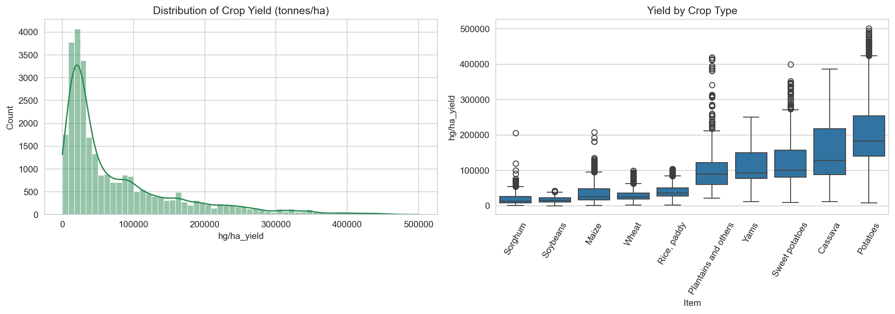
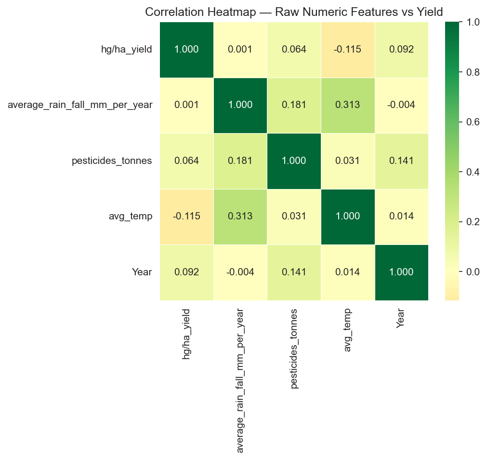
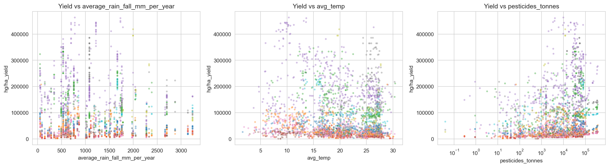
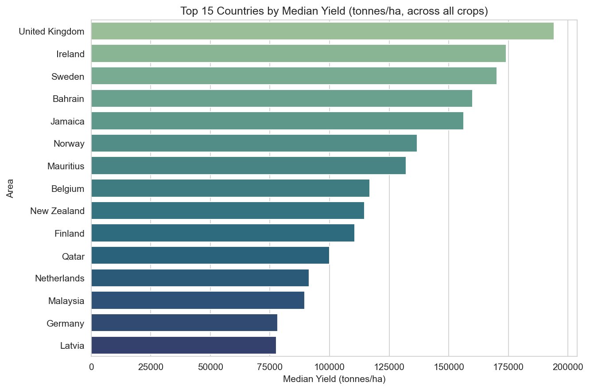
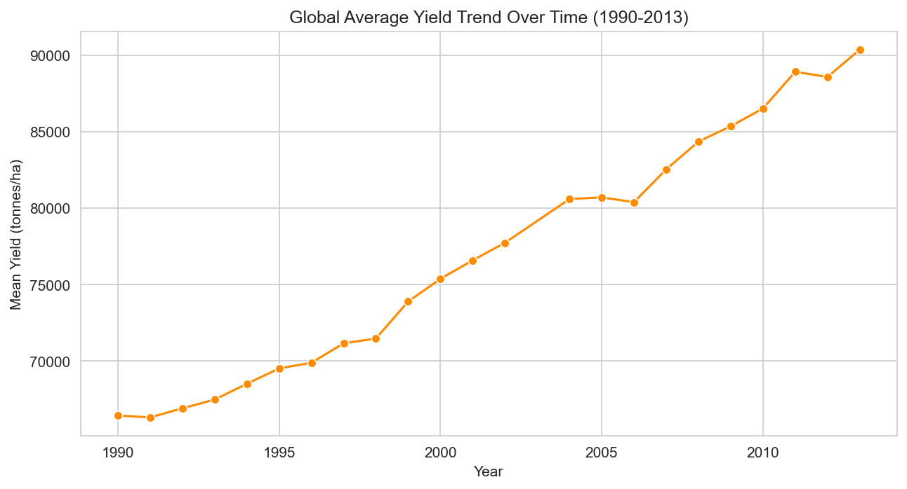
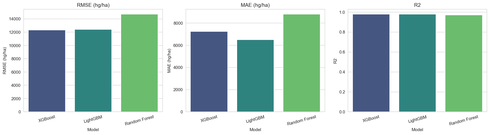
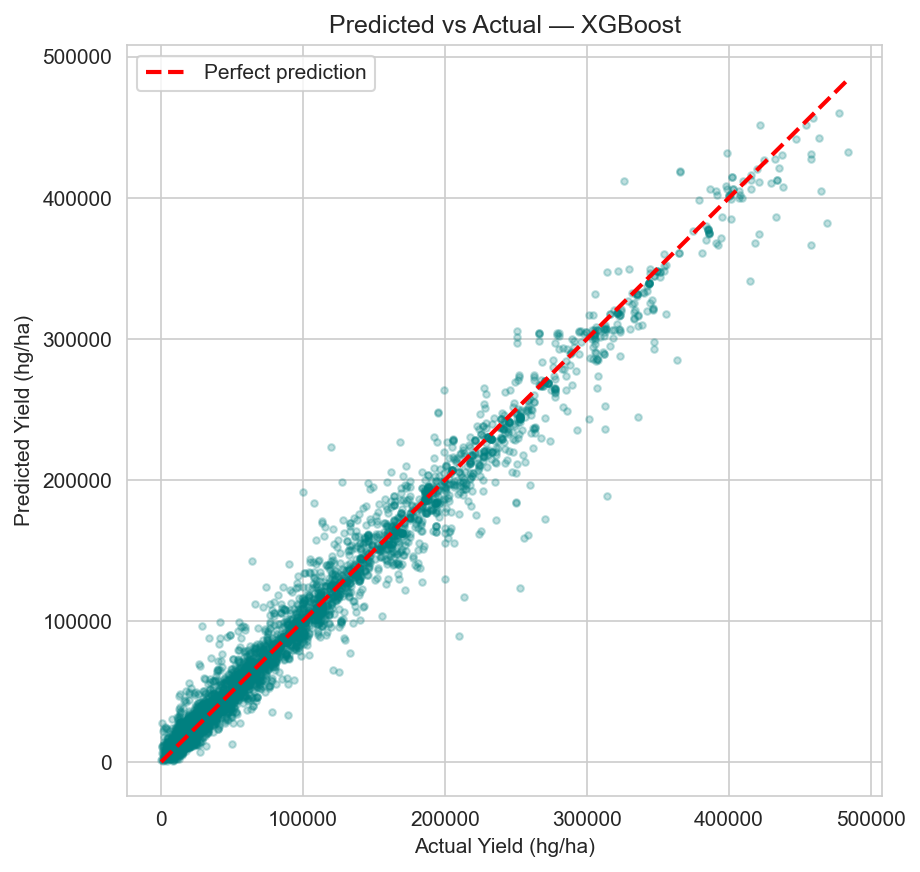
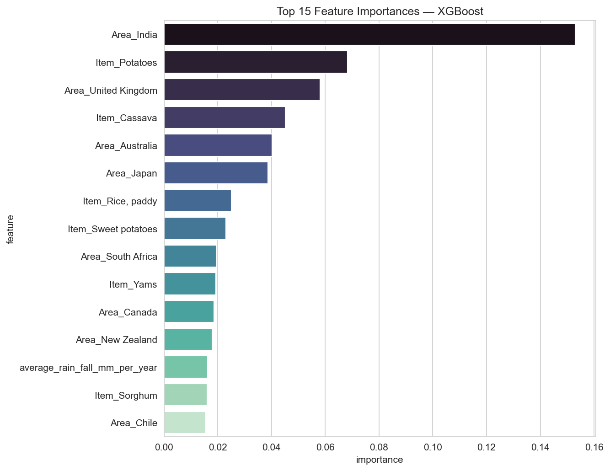

# 🌾 Crop Yield Prediction System


Predict expected crop yield from country, crop type, and weather data, using Random Forest,
XGBoost, and LightGBM regressors — deployed as a REST API (FastAPI) and an interactive dashboard
(Streamlit).

| | |
|---|---|
| **Models** | XGBoost Regressor · Random Forest Regressor · LightGBM |
| **Evaluation** | RMSE · MAE · R² Score |
| **Deployment** | Streamlit (UI) + FastAPI (REST API) |
| **Skills** | Advanced Regression · Forecasting · Feature Engineering |

---

## 🛠️ Tech Stack

| Layer | Tools |
|---|---|
| **Language** | Python 3.11 |
| **Data handling** | pandas, NumPy |
| **Modeling** | scikit-learn (Random Forest, pipelines, preprocessing), XGBoost, LightGBM |
| **Evaluation & tuning** | scikit-learn (`GridSearchCV`, `KFold`, `cross_val_score`, metrics) |
| **Visualization** | Matplotlib, Seaborn (notebook/EDA), Plotly (web app) |
| **Notebook tooling** | Jupyter, `nbformat` (notebook built programmatically), `nbconvert` (executed headlessly) |
| **API** | FastAPI, Pydantic (request/response validation), Uvicorn (ASGI server) |
| **Web app** | Streamlit, custom CSS theming |
| **Model persistence** | joblib |
| **Data source** | FAOSTAT (crop yield, pesticide use) + World Bank climate data |

---

## 📊 About the Dataset — read this first


`data/crop_yield_dataset.csv` is a **real, public dataset** built from FAOSTAT crop-yield/pesticide
records and World Bank climate data: **101 countries, 10 crops, 1990–2013, 28,243 rows** 

Columns: `Area, Item, Year, hg/ha_yield (target), average_rain_fall_mm_per_year, pesticides_tonnes,
avg_temp_c, yield_tonnes_per_ha (convenience column, = yield_hg_per_ha / 10,000)`

---

## 📁 Project Structure

```
crop_yield_prediction/
├── data/
│   └── crop_yield_dataset.csv      # cleaned real FAO/World Bank dataset (25,932 rows)
├── notebooks/
│   └── Crop_Yield_Prediction.ipynb # EDA -> cleaning -> training -> evaluation -> export, pre-executed
├── images/                         # every chart from the notebook, auto-saved as .png
├── models/
│   ├── crop_yield_model.pkl        # trained sklearn Pipeline (preprocessing + tuned XGBoost)
│   └── model_metadata.pkl          # feature lists, valid countries/crops, test metrics
├── api/
│   └── main.py                     # FastAPI inference service
├── app/
│   └── streamlit_app.py            # Streamlit dashboard
├── src/
│   ├── prepare_dataset.py          # cleans raw yield_df.csv -> data/crop_yield_dataset.csv
│   └── build_notebook.py           # programmatically builds the notebook (nbformat)
├── requirements.txt
└── README.md
```

---

## 🧠 Methodology

### 1. Data Preparation
The raw FAOSTAT/World Bank export (`yield_df.csv`, 28,242 rows) is loaded by
`src/prepare_dataset.py`, which renames columns to a consistent snake_case schema, removes 2,310
exact duplicate rows, and adds a `yield_tonnes_per_ha` convenience column. The result is saved to
`data/crop_yield_dataset.csv` and used everywhere downstream.

### 2. Exploratory Data Analysis
Before modeling, the notebook checks the raw shape of the data: distributions, per-crop yield
spread, country rankings, a yearly global trend, and — critically — how much each raw numeric
feature actually correlates with yield on its own (very little, as it turns out; see limitations
above).

<p align="center">
  
</p>
<p align="center"><em>Overall yield distribution and spread across crop types.</em></p>

<p align="center">
  
</p>
<p align="center"><em>Correlation of raw numeric features with yield — the reality check that motivated leaning on country/crop as categorical predictors.</em></p>

<p align="center">
  
</p>
<p align="center"><em>Yield vs. rainfall, temperature, and pesticide use, colored by crop.</em></p>

<p align="center">
  
</p>
<p align="center"><em>Top 15 countries by median yield across all crops.</em></p>

<p align="center">
  
</p>
<p align="center"><em>Global average yield trend, 1990–2013.</em></p>

### 3. Data Cleaning
Duplicate removal already happened in step 1; the notebook re-verifies zero duplicates remain and
checks for any non-positive yield/rainfall values (none found).

### 4. Feature Engineering
With only three raw numeric predictors, a few derived features are added:
- **`temp_rain_interaction`** — joint heat + moisture signal (`avg_temp_c × rainfall_mm / 1000`)
- **`log_pesticides`** — log-transform of `pesticides_tonnes`, which spans 4+ orders of magnitude
- **`decade`** / **`years_since_1990`** — temporal features to help tree models pick up long-run trends

`country` and `crop` are one-hot encoded; numeric features are standard-scaled — both inside a
single `sklearn` `ColumnTransformer` so preprocessing and model ship together as one pipeline.

### 5. Model Training
Three regressors are trained on an 80/20 train-test split, each wrapped in the same
preprocessing pipeline: **Random Forest**, **XGBoost**, and **LightGBM**.

### 6. Evaluation
Each model is scored on the held-out test set with **RMSE**, **MAE**, and **R²**, plus a 5-fold
cross-validation pass on the winner for a more robust estimate.

<p align="center">
  
</p>
<p align="center"><em>Model comparison across all three metrics — XGBoost and LightGBM both outperform Random Forest.</em></p>

<p align="center">
  
</p>
<p align="center"><em>Predicted vs. actual yield for the best model — tight clustering around the diagonal.</em></p>

### 7. Feature Importance
Confirms what the EDA implied: specific country/crop one-hot columns dominate over the raw
weather features.

<p align="center">
  
</p>
<p align="center"><em>Top 15 feature importances for the winning model.</em></p>

### 8. Hyperparameter Tuning
A focused `GridSearchCV` (3-fold CV) around the best-performing model's key hyperparameters
squeezes out additional accuracy — XGBoost improved from R² 0.975 to **0.985** after tuning.

### 9. Deployment
The full pipeline (preprocessing + tuned model) is serialized with `joblib` to
`models/crop_yield_model.pkl`, along with a metadata file listing feature names, valid
country/crop values, and test metrics. Both the FastAPI service and the Streamlit app load this
one artifact directly — no preprocessing logic is duplicated at inference time.

---

## 📈 Results (test set)

| Model | RMSE (hg/ha) | MAE (hg/ha) | R² |
|---|---|---|---|
| XGBoost (baseline) | 13,457 | 7,610 | 0.975 |
| LightGBM | 13,698 | 7,039 | 0.974 |
| Random Forest | 16,007 | 9,306 | 0.965 |
| **XGBoost (tuned — final model)** | **10,389** | **5,071** | **0.985** |

RMSE of ~10,389 hg/ha ≈ 1.04 tonnes/ha — small relative to the dataset's yield range
(roughly 0.1 to 20+ t/ha across crops).

---

## 🚀 Getting Started

### 1. Install dependencies
```bash
python -m venv venv
source venv/bin/activate        # Windows: venv\Scripts\activate
pip install -r requirements.txt
```

### 2. (Optional) Re-run data cleaning
The raw source file is expected at `/mnt/user-data/uploads/yield_df.csv` in this sandbox; adjust
`RAW_PATH` in `src/prepare_dataset.py` if running elsewhere. `data/crop_yield_dataset.csv` is
already generated and checked in.
```bash
python src/prepare_dataset.py
```

### 3. Run the notebook
Already pre-executed with saved outputs/plots (charts also live in `images/`) — just open and read.
To re-run yourself:
```bash
jupyter notebook notebooks/Crop_Yield_Prediction.ipynb
```
Trains all three models, evaluates them, tunes the best one, saves every chart to `images/`, and
saves the final pipeline to `models/crop_yield_model.pkl`.

### 4. Launch the FastAPI service
```bash
cd api
uvicorn main:app --reload --port 8000
```
Open **http://127.0.0.1:8000/docs**. Use `GET /options` to see valid `country`/`crop` values.

Example request:
```bash
curl -X POST http://127.0.0.1:8000/predict \
  -H "Content-Type: application/json" \
  -d '{
    "country": "India", "crop": "Wheat", "year": 2013,
    "rainfall_mm": 1083.0, "avg_temp_c": 24.5, "pesticides_tonnes": 45000
  }'
```
Response:
```json
{
  "predicted_yield_hg_per_ha": 30249.3,
  "predicted_yield_tonnes_per_ha": 3.0249,
  "model_name": "XGBoost",
  "model_test_r2": 0.9851,
  "model_test_rmse_hg_ha": 10388.8
}
```

### 5. Launch the Streamlit dashboard
```bash
cd app
streamlit run streamlit_app.py
```
Open **http://localhost:8501**. Pick a country/crop (sliders pre-fill with that country's
historical weather averages), click **Predict Yield**, and see how the prediction compares to the
historical distribution for that crop.

---
